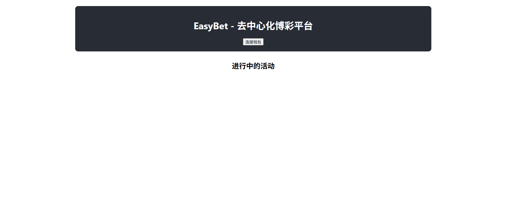
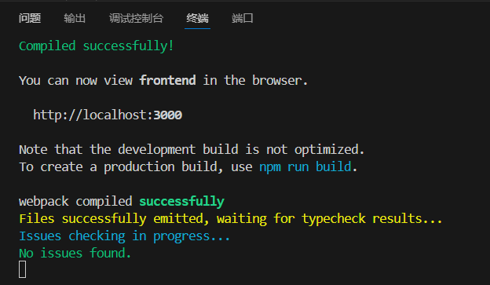
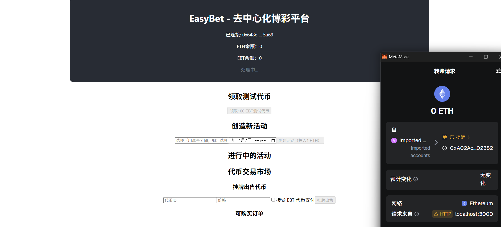

# 去中心化彩票交易系统
项目介绍
    本项目是一个基于区块链的进阶去中心化彩票系统，参考了Polymarket的设计理念。系统允许公证人创建各种竞猜项目（如体育赛事、综艺节目等），玩家可以购买彩票并在结果公布前自由交易，增加了彩票的流动性和可玩性。

核心功能
    基础功能
        公证人管理：创建竞猜项目，设置选项和截止时间
        彩票购买：玩家使用ETH购买彩票，获得ERC721代币凭证
        彩票交易：玩家之间可以自由买卖彩票
        结果结算：公证人公布结果，获胜玩家平分奖池
技术架构
    智能合约
        LotteryContract：主合约，管理竞猜项目和彩票
        LotteryToken (ERC721)：彩票代币合约
        GameToken (ERC20)：游戏积分代币（扩展功能）
        OrderBook：订单簿合约（扩展功能）
    前端技术
        React.js + Web3.js
        以太坊钱包集成（MetaMask）
    环境要求
        Node.js 16+
        Ganache CLI 或 Ganache GUI
        MetaMask 浏览器插件
步骤说明
    1. 启动本地区块链
    BASH
    ## 安装 Ganache CLI
    npm install -g ganache-cli

    ## 启动 Ganache
    ganache-cli -d
    2. 部署智能合约
    进入合约目录：

    BASH
    cd contracts
    安装依赖：

    BASH
    npm install
    编译合约：

    BASH
    npx hardhat compile
    运行测试：

    BASH
    npx hardhat test
    部署合约到Ganache网络：

    BASH
    npx hardhat run scripts/deploy.js --network localhost
    记录部署的合约地址，用于前端配置。

    3. 配置MetaMask
    网络名称：Ganache Local
    RPC URL：http://127.0.0.1:8545
    链ID：1337
    货币符号：ETH
    导入Ganache提供的测试账户私钥。

    4. 启动前端应用
    进入前端目录：

    BASH
    cd frontend
    安装依赖：

    BASH
    npm install
    配置环境变量：

    BASH
    cp .env.example .env
    ## 在.env文件中填入合约地址
    REACT_APP_LOTTERY_CONTRACT_ADDRESS=你的合约地址
    REACT_APP_TOKEN_CONTRACT_ADDRESS=你的代币合约地址
    启动开发服务器：

    BASH
    npm start
    访问 http://localhost:3000 使用应用。

功能实现分析
    1. 公证人功能
    项目创建：公证人可创建竞猜项目，设置选项、奖池和截止时间
    资金托管：奖池资金由合约托管，确保公平性
    结果公布：只有公证人可以在截止时间后公布结果
    2. 玩家功能
    彩票购买：玩家选择选项并支付ETH购买彩票
    代币凭证：每张彩票对应一个唯一的ERC721代币
    彩票查看：玩家可以查看自己持有的彩票
    3. 交易系统
    挂单出售：玩家可以设置价格挂单出售彩票
    直接购买：其他玩家可以查看并购买挂单的彩票
    委托转账：使用ERC721的approve和transferFrom实现安全交易
    4. 结算系统
    自动分配：结果公布后，奖池自动分配给获胜选项的持有者
    比例分配：按持有彩票数量比例分配奖池资金
    5. 扩展功能实现
    ERC20积分：玩家可以领取测试积分，使用积分购买和交易彩票
    订单簿系统：实现链上订单记录，支持按价格排序和最优价格交易
项目运行截图
    
    
    
合约交互流程
    购买彩票
        JAVASCRIPT
        // 前端调用
        await lotteryContract.buyTicket(projectId, optionIndex, {
            value: ticketPrice
        });

        // 合约内部
        function buyTicket(uint256 projectId, uint256 optionIndex) external payable {
            require(msg.value == ticketPrice, "Incorrect payment");
            _mint(msg.sender, newTokenId);
            // 记录彩票信息...
        }
    交易彩票
        JAVASCRIPT
        // 挂单出售
        await lotteryToken.approve(lotteryContract.address, tokenId);
        await lotteryContract.listTicket(tokenId, price);

        // 购买挂单
        await lotteryContract.buyListedTicket(orderId, {
            value: price
        });
测试说明
运行完整测试套件：

    BASH
    cd contracts
    npx hardhat test
测试覆盖：

    项目创建和资金管理
    彩票购买和所有权转移
    交易功能测试
    结算逻辑验证
    权限控制测试

## 参考内容

- 课程的参考Demo见：[DEMOs](https://github.com/LBruyne/blockchain-course-demos)。

- 快速实现 ERC721 和 ERC20：[模版](https://wizard.openzeppelin.com/#erc20)。记得安装相关依赖 ``"@openzeppelin/contracts": "^5.0.0"``。

- 如何实现ETH和ERC20的兑换？ [参考讲解](https://www.wtf.academy/en/docs/solidity-103/DEX/)

如果有其它参考的内容，也请在这里陈列。
